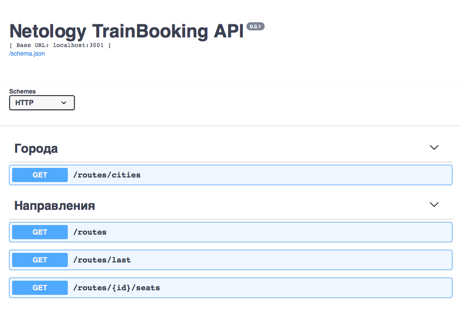
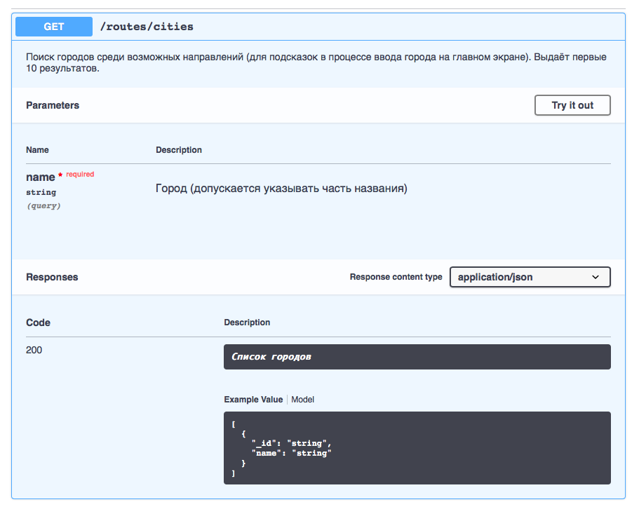
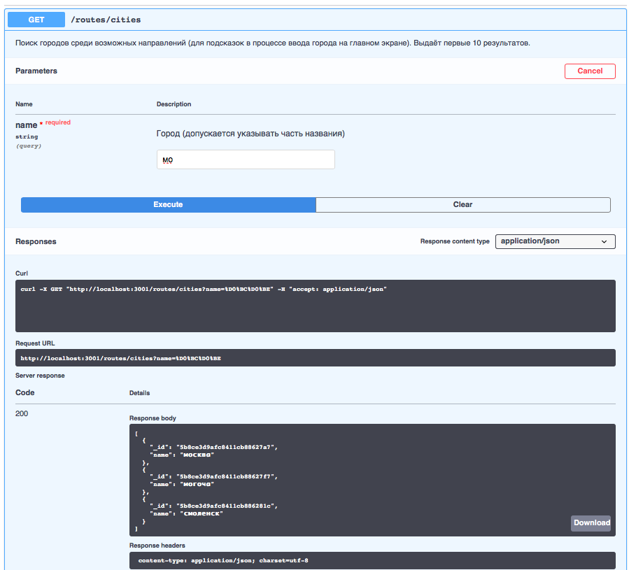
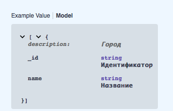

# API сервиса

В настоящий момент детали работы с API вы можете увидеть, запустив команду
```npm run api```. Убедись, что backend-сервис запущен или сделайте это
с помощью команды ```npm run backend```

Вы увидите интерактивную страницу, на которой сможете протестировать 
работу сервиса.



## Основные концепции

Обратите внимание, все запросы вам необходимо совершать по основному адресу API:
*http://localhost:3001*. Например:

```js
fetch( 'http://localhost:3001/routes/cities' )
    .then( response => response.json())
    .then( console.log );
``` 

Ответ по всем доступным адресам API предоставляется в формате JSON.
Слева от каждого адреса располагается метод запроса: GET или POST.
Справа - адрес запроса относительно хоста (*http://localhost:3001*).

## Сведения о запросе и ответе

Для понимания, какие данные необходимо отправлять по соответствующим адресам
и в каком формате, нажмите на интересующий вас цветной блок.



## Тестирование сервиса

Вы можете отправить на сервер какие-то реальные данные и посмотреть,
какой результат будет, нажав на кнопку «Try it out».

Введите необходимые данные и нажмите «Execute» для отправки данных на сервер.
В колонке Results вы увидите полученную информацию.



## Разбор результатов

Для того, чтобы понять, что означает каждое поле результата, нажмите на пункт 
«Model» колонки «Description». Для того, чтобы развернуть описание, нажмите
на стрелочку «>»:



